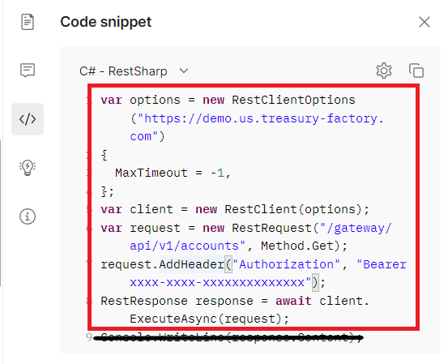
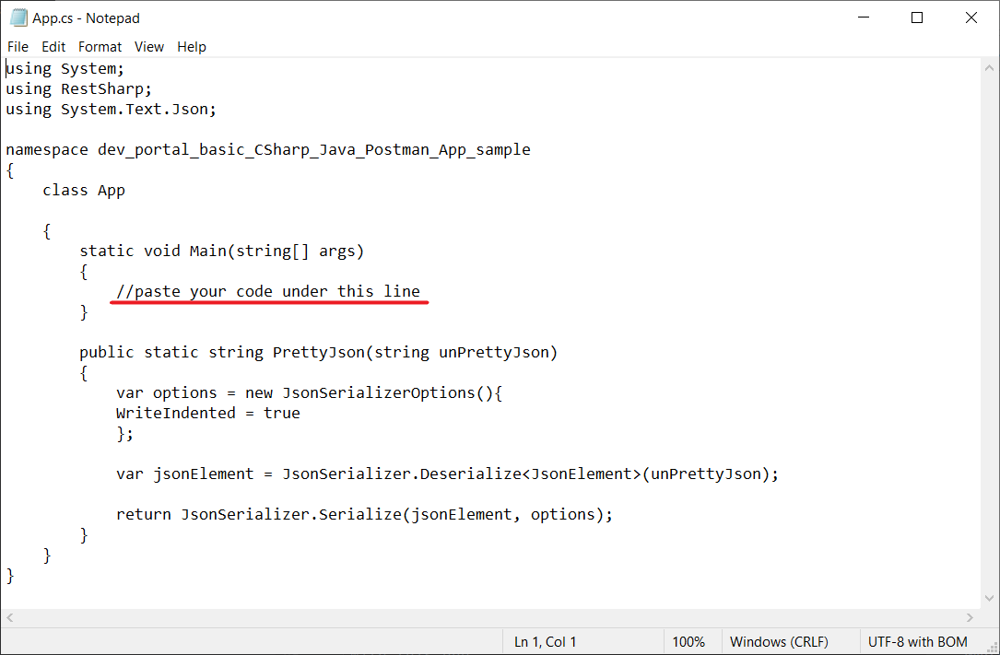

# dev-portal-basic-CSharp-Postman-App

## Requirements

Building the client library requires:

.NET SDK 5.0 or higher - [Installation](https://dotnet.microsoft.com/download/dotnet/sdk-for-vs-code?utm_source=vs-code&amp;utm_medium=referral&amp;utm_campaign=sdk-install)

## Installation

To copy project to your computer copy link of the repository, open command prompt, go to the location where project will be copied and execute git clone command:

```git
git clone https://github.com/kyriba/dev-portal-basic-CSharp-Postman-App-sample.git
```

Then open command prompt and go to your project directory, for example:

```shell
cd dev-portal-basic-CSharp-Postman-App
```

After that, start your project by performing the following steps:

1. Open Postman, select the desired Collection, authenticate through "Get New Access Token" request and run the request that you want to provide in the Application:

2. Proceed to "Code snippet" section.


3. In "Code snippet", proceed to the dropdown list with different programming languages, where "cURL" is set by default, and choose "C# - RestSharp" from the list.

4. There, copy the snippet without the last line to clipboard:



5. In the root of the local folder for this application, open the App.cs file.
   
6. Paste copied code below the underlined commentary:



7. Execute this command in Terminal in root folder of cloned app:

```shell
dotnet run
```

If everything was done accordingly with provided steps, the result is going to be printed in the command prompt.